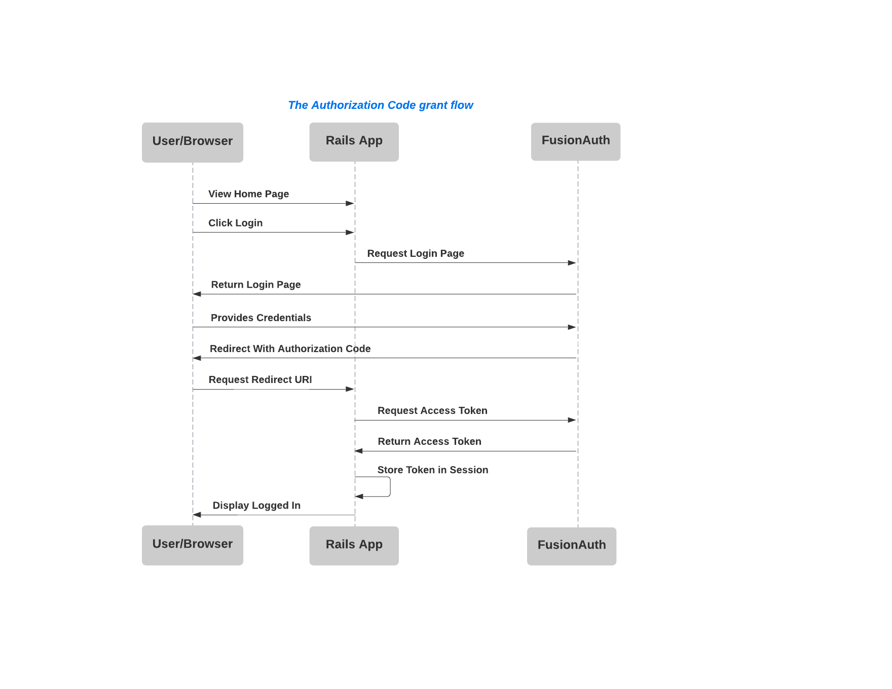

# README


[How to securely implement OAuth in Ruby on Rails](https://fusionauth.io/blog/2020/12/14/how-to-securely-implement-oauth-rails/)

### Prerequisites
- Rails 6
- Docker (optional but preferred for installing FusionAuth)

### Setting up FusionAuth

```bash
curl -o docker-compose.yml https://raw.githubusercontent.com/FusionAuth/fusionauth-containers/master/docker/fusionauth/docker-compose.yml
curl -o .env https://raw.githubusercontent.com/FusionAuth/fusionauth-containers/master/docker/fusionauth/.env
docker-compose up
```

### The Authorization Code grant flow


